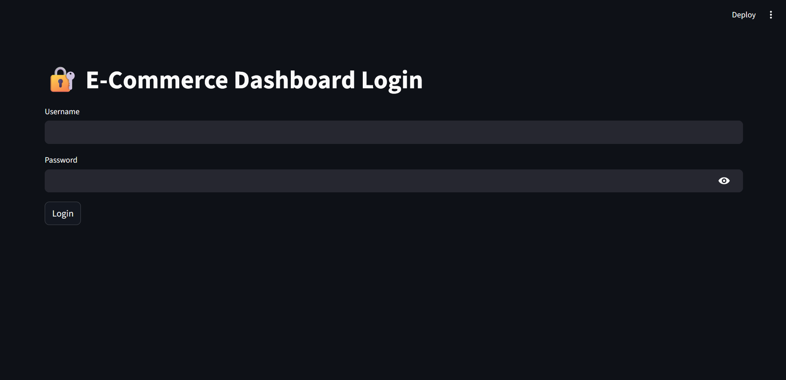
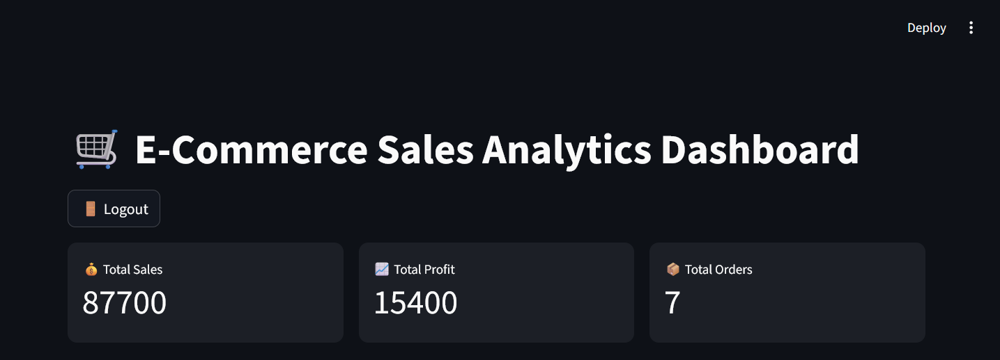
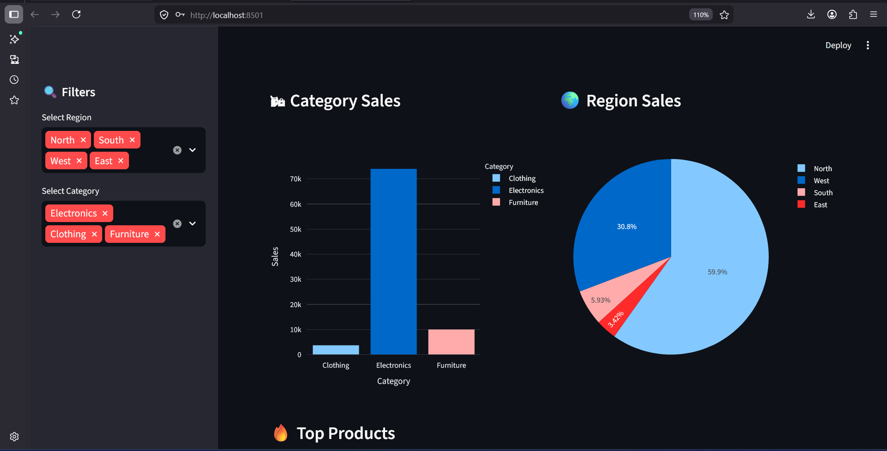

# 🛒 E-Commerce Sales Analytics Dashboard

A professional data analytics dashboard built using Python and Streamlit.

## 📌 Project Overview

This project analyzes e-commerce sales data and provides interactive visualizations for business insights.

The dashboard helps understand:

- Total Sales
- Profit Analysis
- Customer Insights
- Region-wise Performance
- Category-wise Trends
- Monthly Growth

## 🚀 Features

- Interactive Dashboard
- Login System
- KPI Cards
- Sales Trend Analysis
- Category & Region Filters
- Customer Insights
- Dark Premium UI
- Graphs & Charts using Plotly

## Dashboard Preview

### Login Page


### KPI Dashboard


### Charts Section


## 🛠 Technologies Used

- Python
- Streamlit
- Pandas
- Plotly
- Matplotlib

## Backend Features

- SQLite Database Integration
- User Authentication
- Role-Based Access Control
- Activity Logging
- Data Processing using Pandas
- Report Generation

## ▶️ Run Project

Install dependencies:

```bash
pip install -r requirements.txt